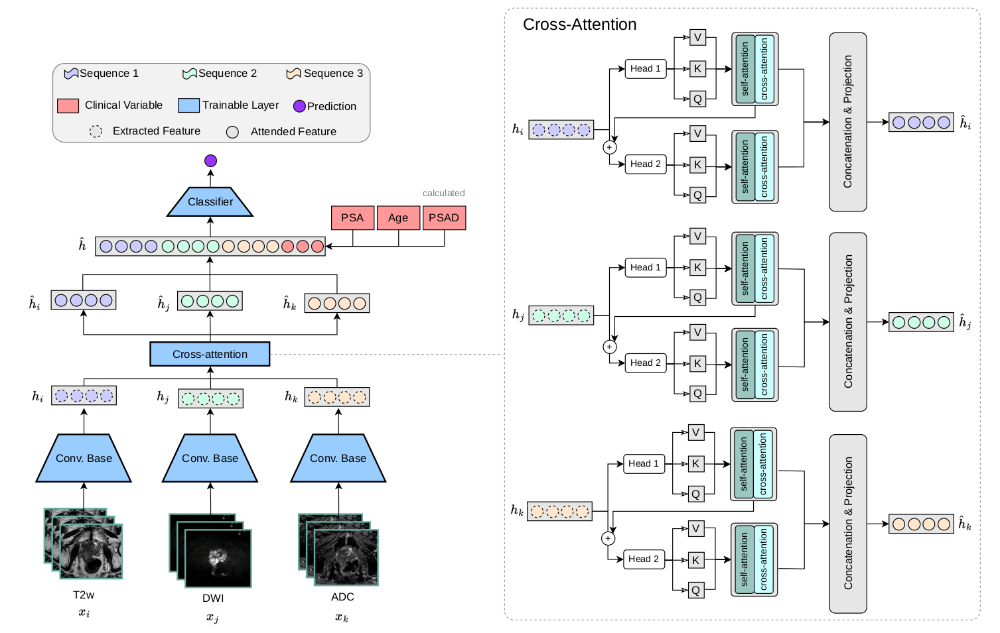
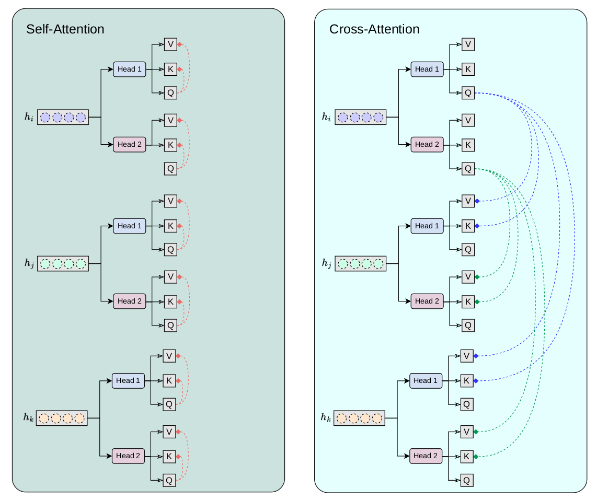

# PCa-classification
Assessing Cancer Presence in Prostate MRI using Multi-Encoder Cross-Attention Networks

This repository provides a bi-parametric MRI classification pipeline for prostate images using PyTorch. It includes the following components:

1. **Architecture Modules**  
   - **VGG_encoder.py** – Implements a 3D VGG-based encoder for extracting deep features from input volumes.  
   - **cross_attention.py** – Implements a custom multi-head cross-attention mechanism to fuse features from multiple sequences (T2w, DWI, ADC).  
   - **dataloader.py** – Contains PyTorch `Dataset` and `DataLoader` classes for handling multi-parametric MRI volumes and clinical data.

2. **Training Code**  
   - **training_validation.py** – The main script to train and validate the model. It sets up training loops, computes metrics (AUC, F1, precision, recall, specificity), and saves the best model.

---

## Table of Contents

- [Overview](#overview)
- [Repository Structure](#repository-structure)
- [Diagrams](#diagrams)
- [Installation](#installation)
- [Usage](#usage)
- [Key Features](#key-features)
- [Results](#results)
- [Customization](#customization)
- [Contributing](#contributing)

---

## Overview

This project aims to classify prostate MRI scans (e.g., distinguishing between cancerous vs. non-cancerous, or any binary pathology) using bi-parametric 3D data. Each patient’s scan consists of three imaging sequences (T2w, DWI, ADC) plus optional clinical variables. The pipeline extracts deep features from each sequence with a 3D VGG-based encoder, and then a custom multi-head cross-attention mechanism outputs new attended feature vectors which along with clinical data pass to the classification head.

---

## Repository Structure

- **VGG_encoder.py**  
  Contains a 3D adaptation of a VGG-based architecture for feature extraction.  

- **cross_attention.py**  
  Implements a custom multi-head cross-attention mechanism.

- **dataloader.py**  
  Prepares datasets for training, validation, and testing. Includes code to handle NIfTI/NumPy volumes, clinical variables, and augmentations (via TorchIO).

- **training_validation.py**  
  Set up model creation, training loops, logging of metrics, saving best models, and generating plots of loss/AUC/F1 precision/recall/specificity.

---

## Diagrams

- ### 1. Full Architecture & Cross-Attention
 - Shows the entire pipeline on the left and the cross-attention module on the right.  

### 2. Detailed Cross-Attention Flow
 – Provides a closer look at the multi-head cross-attention mechanism

## Installation

1. **Clone this repository**:
   ```bash
   git clone https://github.com/VinDimitriadis/PCa-classification.git
   cd PCa-classification

2. install necessary packages

pip install -r requirements.txt


## Usage
1. Data Preparation

    Update paths in dataloader.py with the locations of your T2w, DWI, ADC scans, and clinical data.
    Ensure you have CSV files with patient_id and label columns (for training, validation, testing).
    Each MRI volume should be saved as .npy (or whichever format you’re using), and you’ll load them accordingly in the datasets.

2. Run Training

Once the paths and parameters are set, launch the training process:

python training_validation.py

This script will:

    Create instances of the VGGEncoder modules for T2w, DWI, ADC.
    Use CrossAttention to fuse the features.
    Train a classification head (binary classification by default).
    Log key metrics (loss, accuracy, AUC, F1, precision, recall, specificity).
    Save the best-performing model according to the lowest validation loss.

3. Monitoring Metrics

    During training, metrics are continuously printed to the console.
    The script also generates various plots (loss, AUC, precision/recall, specificity) and saves them as .png files in the working directory.

## Key Features

    3D VGG-based Encoding: Adapted to handle volumetric medical images.
    Custom Cross-Attention: Fuses three different feature sets (T2w, DWI, ADC) in a multi-head attention block.
    Clinical Variable Integration: Clinical data is concatenated to the learned visual features for final classification.
    Comprehensive Metrics: Monitors training/validation accuracy, loss, AUC, F1, precision, recall, and specificity.
    Automatic Model Saving: The best model (based on validation loss) is saved for later inference.

## Results

    The script logs confusion matrices and metric scores for both training and validation sets.
    Best model weights are stored as vgg_bi_parametric_model_Prostate_3D_<epoch>.pt.

## Customization

    Hyperparameters: Modify epochs, learning_rate, weight_decay, batch_size, etc., directly in training_validation.py.
    Network Architecture: Tweak layers in VGG_encoder.py and cross_attention.py (e.g., number of heads, dropout, etc.).
    Data Augmentations: Adjust TorchIO transforms in dataloader.py to suit your needs.
    Additional Tasks: Expand label_category_dict in training_validation.py if you want multi-label or multi-class tasks.

## Contributing

Contributions are welcome! Feel free to open an issue or submit a pull request if you have any suggestions or improvements.

    Fork the repository
    Create a feature branch (git checkout -b feature/new-feature)
    Commit your changes (git commit -m "Add new feature")
    Push to the branch (git push origin feature/new-feature)
    Open a Pull Request


